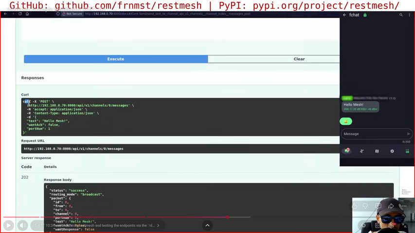

<!--
SPDX-FileCopyrightText: 2026-2026 Franco Masotti (See /README.md)

SPDX-License-Identifier: GPL-3.0-or-later
-->

# restmesh

[](https://pypi.org/project/restmesh/)
[](https://pepy.tech/project/restmesh)
[](https://buymeacoff.ee/frnmst)
[](https://meshtastic.org)
[](https://fastapi.tiangolo.com/)

A stateless thread-safe REST API for Meshtastic.

<!--TOC-->

- [restmesh](#restmesh)
  - [Video](#video)
  - [Description and features](#description-and-features)
  - [Examples](#examples)
  - [Quickstart](#quickstart)
  - [BBS-Style commands](#bbs-style-commands)
  - [Integrations](#integrations)
  - [REST API](#rest-api)
  - [Contributing](#contributing)
  - [Responsible usage policy](#responsible-usage-policy)
  - [FAQ](#faq)
  - [Consulting and custom integrations](#consulting-and-custom-integrations)
  - [License](#license)
  - [Git forge mirrors](#git-forge-mirrors)
  - [Support this project](#support-this-project)

<!--TOC-->

## Video

[](https://www.youtube.com/watch?v=iHP0RuHrN70)
<br>
<sub>Click on the image to [play the video on YouTube](https://www.youtube.com/watch?v=iHP0RuHrN70)</sub>

## Description and features

Send messages on Meshtastic using a standard REST API:

- thread safe via asyncio
- safe because a FIFO queue avoid overwhelming the mesh
- very simple to integrate in other projects:
  [Apprise](https://appriseit.com/) is [already available](#apprise)
- aims to have 100% unit test coverage
- doesn't use a database, it merely acts as a gateway
- no MQTT, WiFI, bluetooth: just plug in the radio via USB, set it as
  `CLIENT_MUTE` and enjoy

## Examples

### Home Assistant Web hook

This will trigger a simple message every 5 minutes to display the total number
of sensors configured in Home Assistant. The trigger event is time based, but
you can configure to send messages from other triggers instead:

1. create a new REST command in the `./configuration.yaml` file:

   ```yaml
   rest_command:
     message_meshtastic:
       url: 'http://127.0.0.1:8000/api/v1/channels/1/messages'
       content_type: 'application/json'
       method: post
       payload: |
         {
           "text": "Home Assistant test: {{ now().isoformat() }}; sensors: {{ states.sensor | length }}"
         }
   ```

2. create the automation trigger in the `./automations.yaml` file:

   ```yaml
   - alias: "Message Meshtastic every 5 minutes"
     description: "Triggers a REST command every 5 minutes"
     trigger:
       - platform: time_pattern
         minutes: "/5"
    action:
      - action: rest_command.message_meshtastic
    mode: single
   ```

3. restart Home Assistant
4. check the `/config/automation/dashboard` page in the web UI

### Error reporting: is Internet down?

A typical use case for restmesh is for system error reporting, for
example when local Internet is down. You could set up a script to interface
with restmesh like how I described in
[Automatic alerts and news on Meshtastic - part 1](https://solvecomputerscience.substack.com/p/automatic-alerts-and-news-on-meshtastic)

### RSS/Atom feeds to mesh: weather warnings

You can also resyndicate RSS/Atom feeds to Meshtastic using a third party
program called feed2exec. You can add as many feeds as you like and schedule
the feed fetching via some cron. See the
[Automatic alerts and news on Meshtastic - part 2](https://solvecomputerscience.substack.com/p/automatic-alerts-and-news-on-meshtastic-part-2)
post.

## Quickstart

### One minute setup

> [!WARNING]
> Although you can install restmesh normally like any other Python package
> with pipx, pip, etc, you should use the [safer method below](#safe-install)
> if you are worried about
> [supply-chain attacks](https://blog.pypi.org/posts/2026-04-02-incident-report-litellm-telnyx-supply-chain-attack/).

1. install [pipx](https://pipx.pypa.io/latest/how-to/install-pipx.html)
2. install restmesh

   ```shell
   pipx install restmesh
   ```

3. your user must have access to the modem. For example on Debian you have
   to add your user to the `dialout` group

   ```shell
   sudo usermod -aG dialout ${USER}
   ```

4. run restmesh

   ```shell
   restmesh
   ```

5. connect to the [/docs](http://127.0.0.1:8000/docs) page using a browser
6. create a Systemd service

   ```ini
   [Unit]
   Requires=network-online.target
   After=network-online.target

   [Service]
   User=meshtastic
   Group=meshtastic
   Type=simple
   ExecStart=/bin/restmesh
   Restart=on-failure

   [Install]
   WantedBy=multi-user.target
   ```

> [!IMPORTANT]
> The modem device may be different that the default one, `/dev/ttyUSB0`.
> Check new devices with `dmesg`. In some cases it might be `/dev/ttyACM0`
> instead. Naming depdends from different loaded kernel modules.

### Safe install

> [!IMPORTANT]
> This prevents most attacks against this package. Checksums are signed with my
> GPG key and compared to the ones stored on PyPI. Installation can complete
> only if hashes and crypto signatures are valid. I can only make this workflow
> available for this top level package, not for its dependencies. Read
> [this post by Mike Gerwitz](https://mikegerwitz.com/2012/05/a-git-horror-story-repository-integrity-with-signed-commits).

1. import my GPG public key:

   ```shell
   curl https://blog.franco.net.eu.org/pubkeys/pgp_pubkey_since_2019.txt | gpg --import
   ```

2. check its fingerprint and compare it with the one stored on DNS:

   ```shell
   gpg --list-keys --fingerprint
   dig TXT franco.net.eu.org +short | grep 'public-key-git-sig-fingerprint'
   ```

   If in doubt, contact me privately to arrange a key exchange.

3. run the [safe install script](./safe_install.sh) with Bash:

   ```shell
   ./safe_install.sh
   ```

4. follow the post-installation instructions from the one minute setup

### CLI help

```
usage: restmesh [-h] [--version] [--host HOST] [--port PORT] [--radio-serial-path RADIO_SERIAL_PATH]

restmesh: stateless thread-safe REST API for Meshtastic

options:
  -h, --help            show this help message and exit
  --version             show program's version number and exit
  --host HOST           server host listening address (default: 127.0.0.1)
  --port PORT           server listening port (default: 8000)
  --radio-serial-path RADIO_SERIAL_PATH
                        path of the USB serial device radio (default: /dev/ttyUSB0)
```

### Running

#### Defaults

```shell
restmesh --host 127.0.0.1 --port 8000 --radio-serial-path /dev/ttyUSB0
```

Connect to [http://127.0.0.1:8000/docs](http://127.0.0.1:8000/docs) for the Swagger page
to test the endpoints, or use [Apprise](#apprise) directly.

#### Globally

```shell
restmesh --host 0.0.0.0 --port 8000 --radio-serial-path /dev/ttyUSB0
```

> [!WARNING]
> At the moment no kind of authentication is implemented!

### Use the Core API

Send to channel 0 (the primary channel):

```shell
curl -X 'POST' \
'http://127.0.0.1:8000/api/v1/channels/0/messages' \
  -H 'accept: application/json' \
  -H 'Content-Type: application/json' \
  -d '{
  "text": "This is a message for the mesh on channel 0!",
  "want_ack": true,
  "port_num": 1
}'
```

Send to node `!0a1b2c3d`:

```shell
curl -X 'POST' \
  'http://127.0.0.1:8000/api/v1/nodes/%210a1b2c3d/messages' \
  -H 'accept: application/json' \
  -H 'Content-Type: application/json' \
  -d '{
  "text": "This is a message for node !0a1b2c3d",
  "want_ack": true,
  "want_response": false,
  "port_num": 1
}'
```

## BBS-Style commands

Some very basic BBS commands are implemented. You have to send direct messages
to the node connected to restmesh. Broadcast messages are ignored. All commands
must start with `!` or `/` and are argument-less.

| Name | Command | Description |
|------|---------|-------------|
| show help | any string that is not a command | prints the help |
| API  | `!api` or `/api` | shows API name, version and credits |
| help | `!help` or `/help` | prints the help |
| MOTD | `!motd` or `/motd` | shows the set Message Of The Day. This will be settable via the API in future restmesh releases |
| ping | `!ping` or `/ping` | node replies with `pong` |

## Integrations

### Apprise

restmesh accepts [Apprise](https://appriseit.com/) via the JSON schema. To be
able to use it you need to
[install it first](https://appriseit.com/getting-started/installation/).
See also the [Repology](https://repology.org/projects/?search=apprise) page
to see the available packages for Apprise.

> [!NOTE]
> The title parameter is ignored! Write your full text in the body.

#### Channel

Simple example using channel 0:

```shell
apprise -b 'My message here' "json://localhost:8000/api/v1/integrations/apprise/channels/0/messages"
```

With parameters:

```shell
apprise -b 'Hello world!' "json://localhost:8000/api/v1/integrations/apprise/channels/0/messages?:want_ack=false&:port_num=1"
```

#### Node

Send a message to the node with hex id `!0a1b2c3d`. Alternatively you can use
the decimal integer representation of the node id, without prepending the
`!` character:

```shell
apprise -b 'My message here' "json://localhost:8000/api/v1/integrations/apprise/nodes/!0a1b2c3d/messages"

apprise -b 'My message here' "json://localhost:8000/api/v1/integrations/apprise/nodes/169552957/messages"
```

With parameters:

```shell
apprise -b 'Hello world!' "json://localhost:8000/api/v1/integrations/apprise/nodes/!0a1b2c3d/messages?:want_response=false&want_ack=true&:port_num=1"

apprise -b 'Hello world!' "json://localhost:8000/api/v1/integrations/apprise/nodes/169552957/messages?:want_response=false&want_ack=true&:port_num=1"
```

## REST API

See the [API](./API.md) file.

## Contributing

See [Contributing](./CONTRIBUTING.md).

## Responsible usage policy

### Meshtastic

In some places, such as Europe, the non-ham LoRa band has limited air time use.
Please don't use restmesh for mass spamming, and never broadcast automated
messages on public channels such as `MediumFast` or `LongFast`. Setup private
channels instead.

restmesh has a basic message FIFO queue also to mitigate the air time problem.

## FAQ

### Why did you create restmesh?

I wanted a very simple zero-effort way to push existing notifications on
Meshtastic as well. None of the solution satisfied me.

### How do you write restmesh?

`restmesh` is the official name of the package, so all lower case.
`Restmesh` or `RestMesh` are both wrong.

### Why the name restmesh?

restmesh = REST [API] + Mesh[tastic]

### Is the objective of restmesh to replicate the official Meshtastic Python CLI 1:1?

No. The objective of restmesh is to simplify automations involving Meshtastic:
some behaviors might be replicated while others will be new and automation
oriented (e.g: substitution via regex).

### Does restmesh have a web UI besides Swagger's one?

Not yet, but a very simple one for debug purposes will be implemented and
served as [http://127.0.0.1:8000/](http://127.0.0.1:8000/)

### Does restmesh manage incoming messages?

Not yet, but something will be implemented.

### Does restmesh support multiple radios at the same time?

No, and there is no plan to do this at the moment: I want to keep things
simple.

### Is there a retry strategy algorithm?

Yes. Meshtastic already has a built-in implementation for a
[*Reliable Zero Hop Messaging*](https://meshtastic.org/docs/overview/mesh-algo/#layer-2-reliable-zero-hop-messaging)
algorithm. When setting the `WantAck` option for broadcast messages, this
applies:

> If a transmitting node does not receive an ACK (or NAK) packet after a certain expiration time, it will use Layer 1 to attempt a re-transmission of the sent packet. A reliable packet (at this 'zero hop' level) will be resent a maximum of three times.

Also:

> If no ACK or NAK has been received by then the local node will internally generate a NAK (either for local consumption or use by higher layers of the protocol).

The `onResponse` callback used in restmesh could implement a simple extra retry
strategy independent from Meshtastic's firmware, and at the moment only a brief
informational logging is printed on the server side when `WantAck` is true and
a NAK is returned, or when `WantResponse` is true

In all API endpoints, by default, `WantAck` is true and `WantResponse` is
false.

### Does restmesh support sending other types of data?

According to the official Meshtastic Python API, you can send binary, position,
text alerts, etc... At the moment restmesh is specific for simple texts but
in the future it might support other types of data. Sending and receiving
binary data may open up interesting possibilities.

## Consulting and custom integrations

If you need help or custom endpoints and integrations, I'm available for
contract-based freelance consulting and custom Python development:

- Email: <solvecomputersciencecollabs+restmesh@gmail.com>
- Freelancing: <https://blog.franco.net.eu.org/jobs/>

## License

Copyright (C) 2026 [Franco Masotti](https://blog.franco.net.eu.org/about/#contacts)

restmesh is free software: you can redistribute it and/or modify it under
the terms of the GNU General Public License as published by the Free
Software Foundation, either version 3 of the License, or (at your
option) any later version.

restmesh is distributed in the hope that it will be useful, but WITHOUT
ANY WARRANTY; without even the implied warranty of MERCHANTABILITY or
FITNESS FOR A PARTICULAR PURPOSE. See the GNU General Public License for
more details.

You should have received a copy of the GNU General Public License along
with restmesh. If not, see <http://www.gnu.org/licenses/>.

## Git forge mirrors

| URL | Type | Notes |
|-----|------|-------|
| https://github.com/frnmst/restmesh | RW | Official home |
| https://codeberg.org/frnmst/restmesh | RW | Mirror |
| https://framagit.org/frnmst/restmesh | RW | Mirror |
| https://repos.franco.net.eu.org/frnmst/restmesh | RW | Mirror |

## Support this project

- [GitHub Sponsors](https://github.com/sponsors/frnmst)
- [Buy Me a Coffee](https://www.buymeacoffee.com/frnmst)
- [Liberapay](https://liberapay.com/frnmst)
